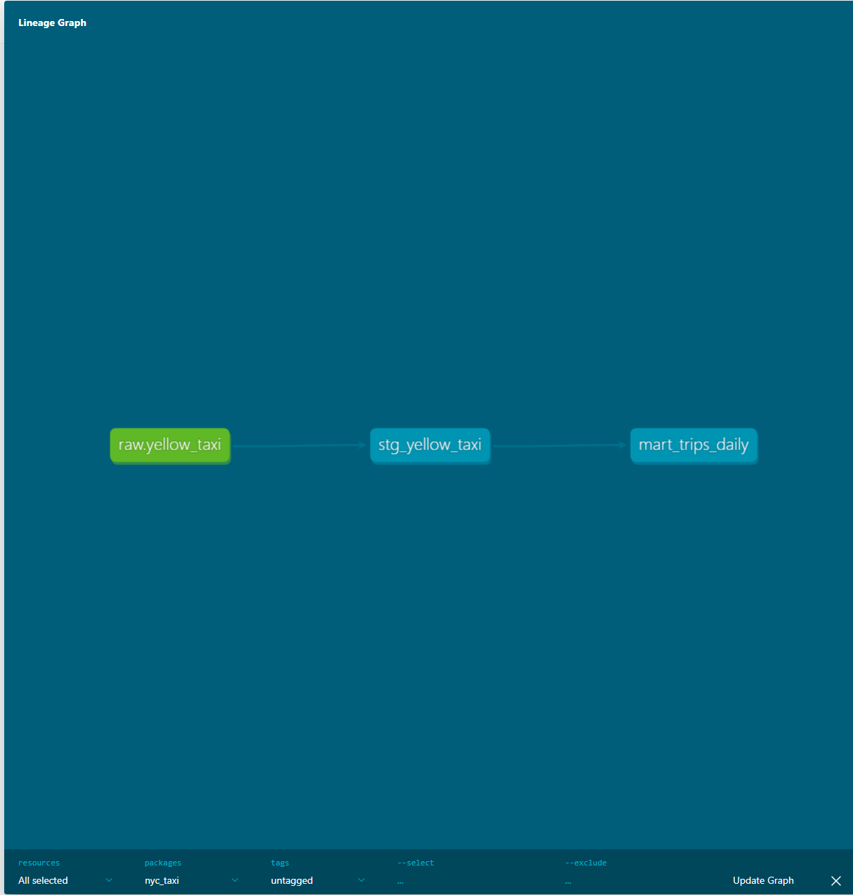

# NYC Yellow Taxi: dbt + Snowflake Pipeline

An ELT pipeline that loads NYC Yellow Taxi trip data from AWS S3 into Snowflake, then uses dbt to clean, test, and aggregate it into analytics-ready tables. Raw Parquet is loaded with COPY INTO, transformed through a staging layer (view), and aggregated into a daily mart (table), all version-controlled, tested, and documented with a generated lineage graph.

## Stack

- **Snowflake**: cloud data warehouse (storage + compute)
- **dbt** (dbt-snowflake): transformation, testing, documentation
- **AWS S3**: raw data landing zone
- **SQL**: all transformations
- **Python**: local load script (AWS CLI upload)

## Architecture

```
S3 (raw Parquet)
  -> Snowflake RAW schema (COPY INTO via external stage + storage integration)
  -> dbt staging model (view: cleaned, typed, filtered)
  -> dbt mart model (table: daily aggregates)
```

## What It Does

This ELT pipeline ingests NYC Yellow Taxi trip data and turns ~3.07M raw trip records into a clean, tested, daily-aggregated analytics table.

The raw Parquet file is loaded into AWS S3 under a partitioned path, then loaded into a Snowflake RAW table using COPY INTO via an external stage and storage integration. That raw table becomes the dbt source. dbt then transforms it through two layers: a staging model that cleans the data (removing junk rows and renaming columns) materialized as a view, and a mart model that aggregates the cleaned trips by day, materialized as a table. The result reduces ~3.07M raw rows to a 31-row daily summary for January 2023.

## Data

- **Source**: NYC Taxi & Limousine Commission (TLC) Trip Record Data, Yellow Taxi
- **Period**: January 2023
- **Format**: Apache Parquet
- **Volume**: ~3.07M raw trip records
- **Fields used**: trip timestamps, passenger count, trip distance, payment type, fare and total amounts, pickup/dropoff location IDs

## Models

**`stg_yellow_taxi`** (staging, materialized as a view)
One row per trip. Selects 11 columns explicitly from the raw source, renames location columns for clarity, and filters out invalid rows (non-positive distance or fare) and records outside January 2023. This is the cleaned silver layer all downstream models build on.

**`mart_trips_daily`** (mart, materialized as a table)
One row per calendar day. Aggregates the staged trips into daily metrics: total trips (COUNT), total revenue (SUM of total amount), and average trip distance (AVG). The gold layer, the analytics-ready output.

## Tests

8 dbt tests run across the two models, guarding the guarantees each layer must hold.

**Staging (`stg_yellow_taxi`)**
- `not_null` on `vendor_id`, `pickup_datetime`, `dropoff_datetime`: these define a real trip; a null here signals upstream corruption.
- `accepted_values` on `payment_type`: values must fall in [0-6]; anything else means an unexpected category entered the data.

**Mart (`mart_trips_daily`)**
- `unique` + `not_null` on `trip_date`: the mart's primary key. Uniqueness confirms the daily aggregation produced exactly one row per day.
- `not_null` on `total_trips`, `total_revenue`: a day in the table exists because trips occurred, so these must be populated.

## Key Design Decisions

**1. ELT, not ETL**
Raw data is loaded into Snowflake first, then transformed in-warehouse with dbt. There's no intermediate transformation store: extract from S3, load to Snowflake via COPY INTO, transform in place. This is the pattern the Snowflake + dbt stack is built for, and it contrasts with an ETL approach (e.g. transforming in pandas before loading) used elsewhere in my portfolio.

**2. `payment_type = 0` kept, not filtered**
The TLC data dictionary documents payment types 1-6, but the data contains 64,203 rows (2.1%) with value 0, an undocumented but systematic category, most likely "payment type not recorded." Rather than delete 2% of real trips to satisfy a test, I extended the `accepted_values` list to [0-6], documenting 0 as a known value. A test failing on legitimate data means the test is wrong, not the data.

**3. January filter in the staging layer**
Rows outside January 2023 (meter-clock errors producing 2008/2022 dates) are filtered in staging. Tradeoff, explicitly accepted: this couples the staging model to a single-month dataset. In a multi-month pipeline this filter would move to a dataset-scope configuration rather than living in staging, so it doesn't silently drop future months. Acceptable here because the project scope is one month by design.

**4. Materialization: staging as view, mart as table**
Staging is a view, a cheap, always-fresh 1:1 cleaning pass over raw that isn't queried directly. The mart is a table, an aggregate that's queried repeatedly, so the 3.07M to 31 row reduction is computed once and stored rather than recomputed on every read. Materialization matches access pattern.

## How to Run

This is a cloud pipeline. Reproducing it requires your own AWS and Snowflake accounts and the IAM integration between them. It is not a one-command clone-and-run.

### Prerequisites

- A Snowflake account (trial is sufficient)
- An AWS account with an S3 bucket
- Python 3.12 (dbt does not support 3.13+)
- `dbt-snowflake` installed in a virtual environment

### Steps

**1. Land the data in S3**
Download the NYC TLC Yellow Taxi January 2023 Parquet file and upload it to your S3 bucket under a partitioned path:
```
aws s3 cp yellow_tripdata_2023-01.parquet \
  s3://<your-bucket>/raw/yellow_taxi/2023/01/ --region <your-region>
```

**2. Set up Snowflake objects**
Create the warehouse, database, and schemas:
```sql
CREATE WAREHOUSE transforming_wh
  WITH WAREHOUSE_SIZE = 'X-SMALL' AUTO_SUSPEND = 60 AUTO_RESUME = TRUE;
CREATE DATABASE nyc_taxi;
CREATE SCHEMA nyc_taxi.raw;
CREATE SCHEMA nyc_taxi.analytics;
```

**3. Connect Snowflake to S3 (IAM handshake)**
Create a storage integration, retrieve its generated IAM user ARN and external ID (`DESC INTEGRATION`), then create an IAM role in AWS whose trust policy allows that identity to assume it, with an S3 read policy on the bucket. Create an external stage pointing at the bucket via the integration.

**4. Load the raw table**
Create the `raw.yellow_taxi` table and load it with `COPY INTO` from the stage, casting Parquet timestamps with `TO_TIMESTAMP(..., 6)`.

**5. Configure dbt**
Set `profiles.yml` with your Snowflake account identifier (`<org>-<account>` format), user, role, warehouse (`TRANSFORMING_WH`), database (`NYC_TAXI`), and schema (`ANALYTICS`). Verify with `dbt debug`.

**6. Build and test**
```
dbt run        # builds staging view + mart table
dbt test       # runs all 8 tests
dbt docs generate && dbt docs serve   # generates the lineage docs
```

## Lineage

The dbt-generated lineage graph showing the full dependency chain from source to mart:

```
raw.yellow_taxi  ->  stg_yellow_taxi  ->  mart_trips_daily
   (source)            (staging view)        (mart table)
```

